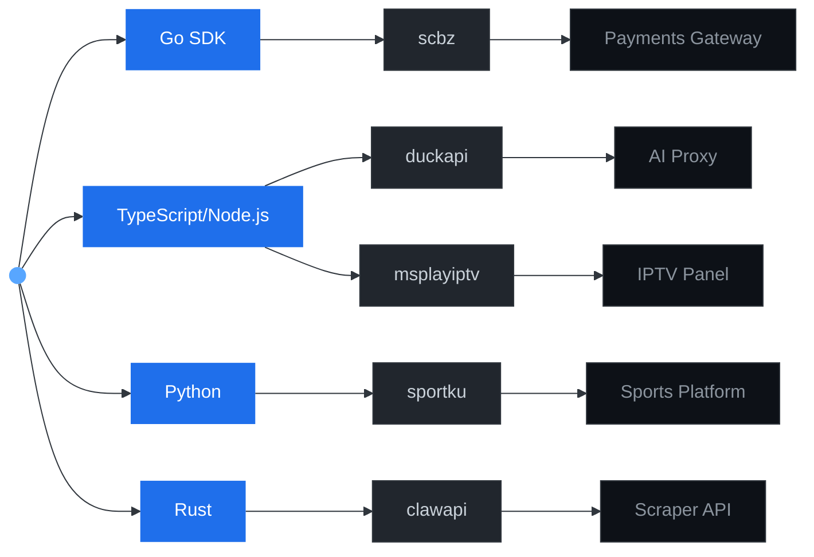

<h1>
  <picture>
    <source media="(prefers-color-scheme: dark)" srcset="https://readme-typing-svg.demolab.com?font=Fira+Code&weight=500&size=28&duration=2500&pause=500&color=58A6FF&center=true&vCenter=true&width=500&lines=Hiroto+Masato;Build.+Ship.+Scale.">
    
  </picture>
</h1>

  
  
  

Building backend infrastructure, payment gateways, and developer tooling. Focus on clean architecture, protocol-level correctness, and zero-dependency where it counts.

---

### Stack

| Layer | Tech |
|---|---|
| **Languages** | Go, TypeScript, Python, Rust |
| **Infra** | Docker, Linux, Cloudflare Workers |
| **Databases** | PostgreSQL, SQLite, Redis |
| **Protocols** | gRPC, REST, WebSocket, SSE |

### Projects

| Repo | Description |
|---|---|
| [scbz](https://github.com/hirotomasato/scbz) | Go SDK & REST gateway — SociaBuzz donations, 18 countries, 100+ payment methods |
| [duckapi](https://github.com/hirotomasato/duckapi) | OpenAI/Anthropic-compatible API for Duck.ai — streaming chat, image gen, session reuse |
| [msplayiptv](https://github.com/hirotomasato/msplayiptv) | IPTV management panel |
| [sportku](https://github.com/hirotomasato/sportku) | Sports platform |
| [clawapi](https://github.com/hirotomasato/clawapi) | Scraper API |

---

  <picture>
    <source media="(prefers-color-scheme: dark)" srcset="https://github-readme-stats.vercel.app/api?username=hirotomasato&show_icons=true&hide_title=true&count_private=true&hide_rank=true&include_all_commits=true&bg_color=0d1117&text_color=c9d1d9&icon_color=58a6ff&border_color=30363d&border_radius=6">
    
  </picture>
  &nbsp;
  <picture>
    <source media="(prefers-color-scheme: dark)" srcset="https://github-readme-stats.vercel.app/api/top-langs/?username=hirotomasato&layout=compact&bg_color=0d1117&text_color=c9d1d9&border_color=30363d&border_radius=6&hide_title=true">
    
  </picture>

  <code>scbz</code> · <code>duckapi</code> · <code>hiroto</code>

